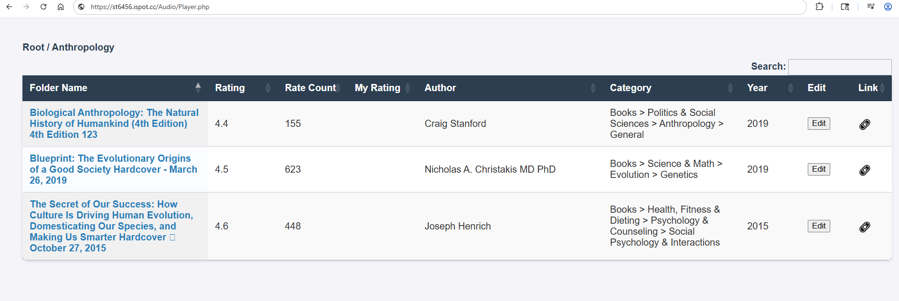
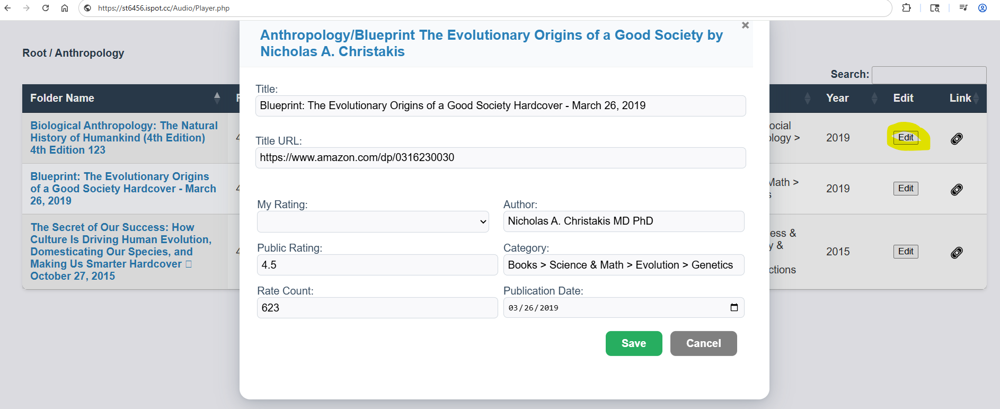
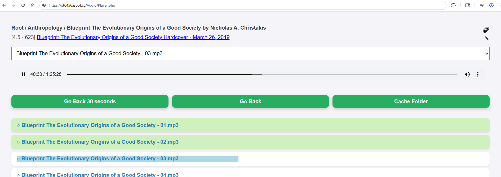

# Audiobook Player

I have bunch of mp3 audiobooks that I wanted to play wherever I am away from my desk.  So I wrote this...







## Features
- PHP or ASP.NET
- Desktop and Mobile friendly
- MySQL to store metadata
- Assumes each folder holds one audiobook
- Offline mode let you download files
- VB Script that Selenium  to scrape the web and update Book info (Link, Title, Author, Rating, Pub date)
- Ability to set my own rating

## How to use (PHP):
- Buy storage from interserver ($3 per month for 1 TB) https://www.interserver.net/storage/
- Upload your mp3 audiobooks
- Copy files from the project to the root folder.
- Create MySQL database in interserver
- Create config.php, update conenction info and copy it to the server next to Player.php

```PHP
<?php
// Database configuration. DO NOT commit this file to version control!
return [
    'DB_HOST' => '123.123.123.123',
    'DB_NAME' => 'Audio',
    'DB_USER' => 'Audio',
    'DB_PASS' => 'password1'
];
```

## How to use (ASP.NET):
- Buy purchase from godaddy ($6 per month for 25 GB) https://www.godaddy.com/hosting-solutions
- Upload your mp3 audiobooks
- Copy files from the project to the root folder.
- Create MySQL database in godaddy
- Create web.config, update conenction info and copy it to the server next to Player.php

```XML
<?xml version="1.0"?>
<configuration>
  <appSettings>
    <add key="AudioDb" value="Server=123.123.123.123;Database=Audio;Uid=Audio;Pwd=pass1;" />
  </appSettings>  
</configuration>
```

Point your browser to Player.php

